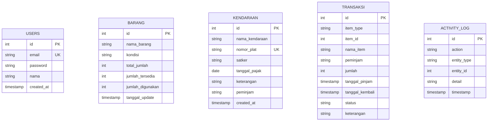

# Aplikasi Inventaris Kantor (Full-Stack Management System)

Sistem informasi berbasis web modern untuk mendigitalkan pencatatan, pelacakan sirkulasi peminjaman, audit trail, serta pelaporan aset **Barang** (berbasis kuantitas stok) dan **Kendaraan Dinas** (berbasis unit fisik unik & status pajak) pada lingkungan operasional kantor.

---

## 🛠️ Tech Stack & Keputusan Arsitektur

| Layer | Teknologi | Alasan Pemilihan & Arsitektur |
|---|---|---|
| **Frontend** | React (Vite) + TailwindCSS | SPA responsif, modern, cepat, dan antarmuka bersih (*rich aesthetics*). |
| **State & Data Fetching** | TanStack Query (React Query) | Menghilangkan manual `useEffect`, menyediakan auto-caching, refetching, serta handling loading/error state. |
| **Backend** | Node.js + Express REST API | Memisahkan *business logic* dari database API untuk portofolio backend yang solid. |
| **Database** | PostgreSQL (Supabase / Local) | Database relasional tangguh dengan ACID transactions dan integrity constraints. |
| **Auth & Security** | Custom JWT + Bcrypt + httpOnly Cookie | Token disimpan di `httpOnly` cookie untuk mencegah risiko XSS, diproteksi Express Rate Limiter untuk mencegah brute force. |
| **Export Tools** | `exceljs` & `pdfkit` | Menghasilkan berkas `.xlsx` dan `.pdf` terstruktur langsung dari server. |

### 📌 Keputusan Desain Utama:
1. **Layer Separation (`route → controller → service → model`):**
   - **Controller:** Hanya menangani request/response HTTP dan status code.
   - **Service:** Menangani aturan bisnis inti (validasi stok, perhitungan status pajak on-the-fly, logging otomatis).
   - **Model:** Menangani interaksi query database murni.
2. **Computed Fields (Non-Editable Direct CRUD):**
   - Stok barang (`jumlah_tersedia = total_jumlah - jumlah_digunakan`) tidak dapat diisi manual dari form CRUD. Perubahan stok hanya terjadi melalui transaksi peminjaman/pengembalian.
   - Status pajak kendaraan (`Aktif`, `Akan Habis ≤30 Hari`, `Expired`) dihitung otomatis berdasarkan tanggal hari ini vs tanggal pajak.
3. **Database Transaction (ACID):**
   - Operasi pinjam/kembali item dibungkus dalam blok `BEGIN ... COMMIT ... ROLLBACK` untuk menjamin konsistensi multi-tabel (`barang`/`kendaraan`, `transaksi`, `activity_log`).
4. **Tabel Terpisah (`barang` vs `kendaraan`):**
   - Karakteristik data berbeda (stok kuantitas vs identitas unik plat nomor & pajak) dipisahkan agar skema database normal dan konsisten.

---

## 🗄️ Struktur Database (PostgreSQL)



---

## 🚀 Panduan Instalasi & Menjalankan Proyek

### 1. Prasyarat
- Node.js (v18+)
- Database PostgreSQL (Lokal atau Supabase Cloud)

### 2. Setup Backend (`server`)
```bash
cd server
npm install
cp .env.example .env
```
Sesuaikan konfigurasi `DATABASE_URL` dan `JWT_SECRET` pada file `.env`.

Jalankan migrasi skema & data demo awal:
```bash
npm run migrate
```

Jalankan server backend:
```bash
npm run dev
# Server berjalan di http://localhost:5000
```

### 3. Setup Frontend (`client`)
```bash
cd ../client
npm install
npm run dev
# Client berjalan di http://localhost:5173
```

---

## 🔑 Kredensial Login Default

- **Email:** `admin@kantor.com`
- **Password:** `admin123`

---

## 📋 Fitur Utama yang Disediakan

- [x] **Autentikasi Aman:** Login admin dengan rate limiter & httpOnly cookie JWT.
- [x] **Dashboard Ringkas:** Statistik realtime stok, kendaraan dipinjam, dan banner alert pajak.
- [x] **Manajemen Barang:** Pencatatan stok peralatan kantor dengan kondisi fisik dan auto-computed status ketersediaan.
- [x] **Manajemen Kendaraan:** Pemantauan plat nomor unik, satker, dan jatuh tempo pajak kendaraan dinas.
- [x] **Peminjaman & Pengembalian:** Validasi stok tersedia, pencegahan double-booking kendaraan, dan pemulihan stok atomik.
- [x] **Activity Log (Audit Trail):** Pencatatan otomatis setiap aksi create, update, delete, pinjam, kembali, dan login.
- [x] **Ekspor Laporan:** Unduh laporan snapshot inventaris dan riwayat sirkulasi dalam format Excel (`.xlsx`) & PDF (`.pdf`).

---

## 🔍 Known Trade-Offs & Batasan
- **Single Admin User (Fase 1):** Sistem dirancang untuk satu akun admin pengelola gudang. Multi-role dan notifikasi real-time WebSocket disiapkan untuk Fase 2 sesuai PRD.
